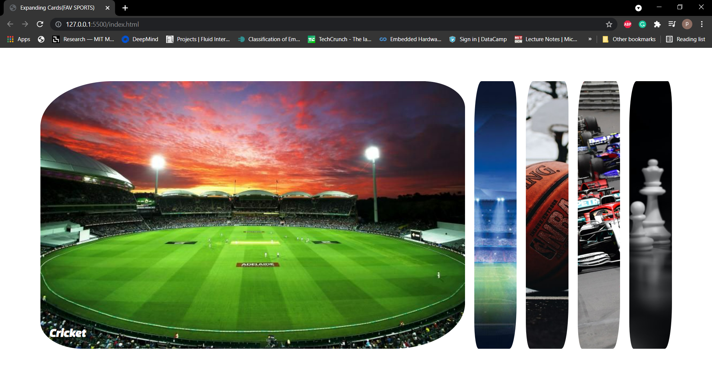
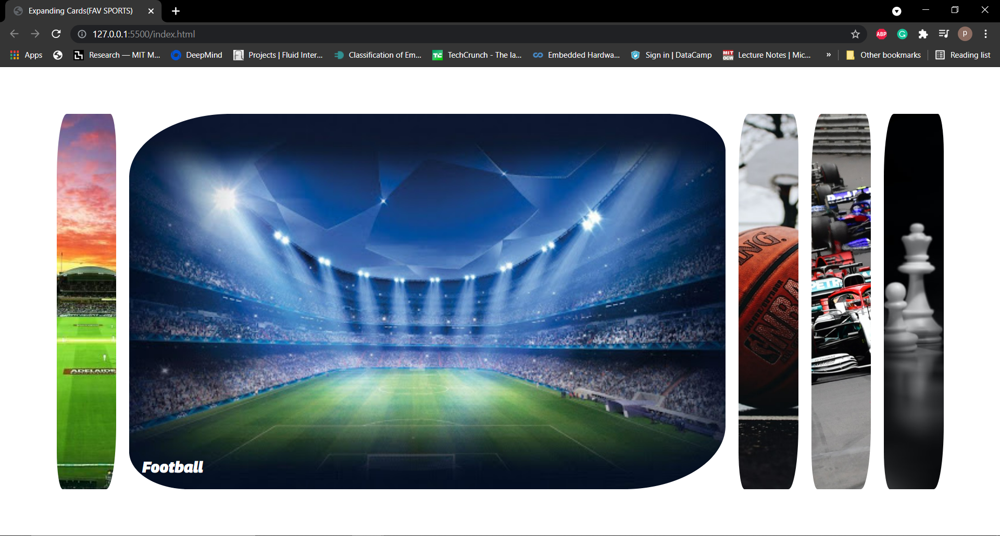
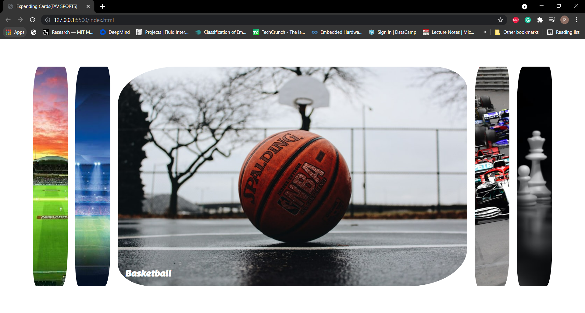
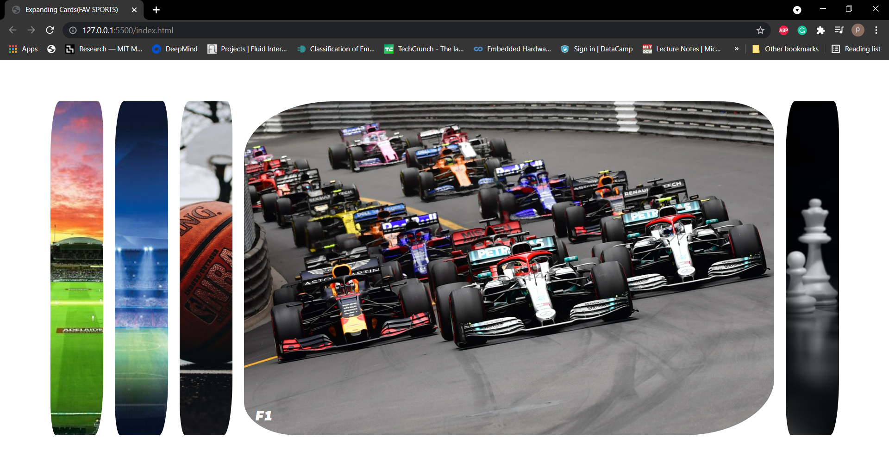
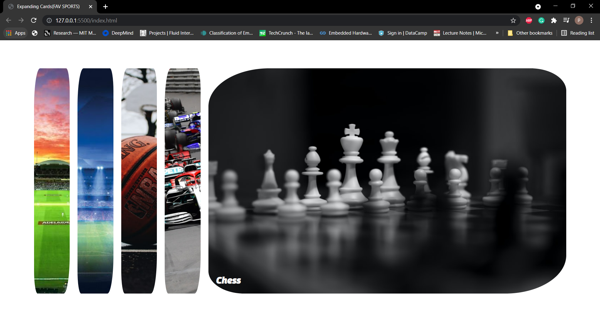

# Expanding cards
This project was created to practice basic concepts of building HTML, CSS, JavaScript.
## Concepts covered-
* Working with core components
* Learning Stylesheet
* Working with pseudo class selector

## Preview
 

 

 

 

 

 

